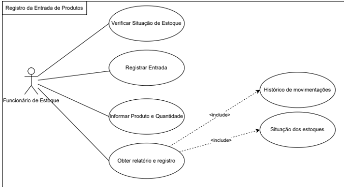

# Diagrama de Caso de Uso

O `sistema de assistente de viagens` possui funcionalidades descritas no plano de requisitos e seus casos de uso seguem uma estrutura aprensentada a seguir. 

## Versão macro

### Cenário de caso de uso (CCU1) - Pesquisa de novas viagens

Referente ao requisito funcional 1 (RF1: `pesquisa de novas viagens`)

- Ator primário:
- Ator secundário:
- Fluxo principal

|Etapa| Descrição| Pacotes envolvidos|
|---|---|---|
|1|Acessar|Auth|
|2|Login|Auth|
|3|Busca|Buscador|
|4|Busca de ticket de viagem|Crawler|

### Cenário de caso de uso (CCU2) - Cadastro de viajantes

Referente ao requisito funcional 2 (RF1: `Cadastro de viajantes`)

|Etapa| Descrição| Pacotes envolvidos|
|---|---|---|
|1|Abir Cadastro|CadViagem|
|2|Checagem|Validador|
|3|Incluir dados viajange|CadViagem|